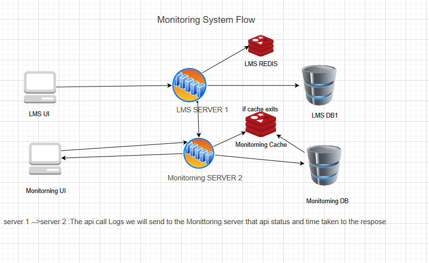

# RealTime API Monitoring System

A simple real-time API monitoring dashboard built using **React, Node.js, Express, MongoDB, and Socket.io**.  
It tracks API performance, status, and errors in real time and displays live updates on the frontend.

> [!NOTE]
> This project is currently in the **implementation phase**.  
> So far, only the **frontend UI** has been completed.  
> Core backend functionality, real-time API monitoring, group collaboration features, and the **Team-Based Smart Notification System** are planned for upcoming versions.

## Problem Statement

In many applications, API failures, slow responses, and critical errors are not noticed immediately.  
This project is designed to solve that problem by providing a real-time monitoring dashboard that can help teams track API health and respond faster to issues.

## Features

- Real-time API logging
- Response time tracking
- Error detection for **4xx / 5xx**
- API performance monitoring
- Live alerts using WebSockets
- Dashboard visualization ready

## Tech Stack

- **React.js** — Frontend
- **Node.js** — Runtime environment
- **Express.js** — Backend framework
- **MongoDB** — Database
- **Socket.io** — Real-time communication
- **Axios** — API requests

## Architecture / How It Works

1. Frontend calls the API.
2. Backend receives and processes the request.
3. Middleware captures request details such as status code, response time, and endpoint.
4. Server emits updates using **Socket.io**.
5. Frontend receives real-time updates instantly and refreshes the UI.

## Project Structure

```bash
server/
├── config/
├── routes/
├── middleware/
├── sockets/
├── models/
└── server.js

client/
├── src/
├── components/
├── pages/
├── services/
└── socket.js
```

## Setup Instructions

### Prerequisites

Make sure you have installed:

- Node.js
- MongoDB
- npm or yarn

### Clone the repository

```bash
git clone https://github.com/ravitharun/ReatimeApiMonitorning
```

### Setup backend

```bash
cd server
npm install
npm start
```

### Setup frontend

```bash
cd UI
npm install
npm start
```

### Environment Variables

Create a `.env` file inside the `server` folder and add:

```env
PORT=8000
MONGO_URI=your_mongodb_connection_string
```

## Future Improvements

- Live charts with **Recharts**
- Authentication system
- Role-based dashboard
- Advanced logging system
- Group collaboration feature
- Team-Based Smart Notification System
- Email + socket hybrid alert engine

## Author

**Built by Ravi Tharun 🚀**  
Focused on building real-world full-stack monitoring systems.